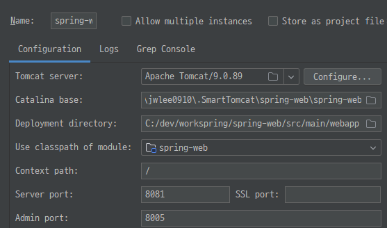

## Part2 

◼ Servlete 은 3.0 이상으로 변경
```bazaar
        <!-- 서블릿 API 4.0 : web.xml 의 버전과 매핑  -->
        <dependency>
            <groupId>javax.servlet</groupId>
            <artifactId>javax.servlet-api</artifactId>
            <version>4.0.1</version>
            <scope>provided</scope>
        </dependency>
```
◼ Context root 변경  
/
- Tomcat 의 경우  
  

- IntelliJ 의 경우  


◼ List / Array   

```bazaar
  @GetMapping("/list")
  public String getList(@RequestParam("ids")ArrayList<String> ids) {
    
    log.info("ids: " + ids);
    
    return "list";
  }
```
◼ RedirectAttribute  
- 화면에 한번만 전달되는 파라미터 처리
- 내부적으로 HttpSession 객체에 담아서 한번만 사용되고 폐기 됨
```bazaar
    @PostMapping("/register") // 엔드포인트에 대한 HTTP POST 요청을 처리
	public String register(BoardVO board, RedirectAttributes rttr) {

		log.info("/register ==>[등록] bNo{} " , board.getBno());
		// Register the board using the boardService
		boardService.register(board);

		log.info("Add a flash attribute to the redirect URL bNo{} " , board.getBno());
		rttr.addFlashAttribute("result", board.getBno());

		log.info("Redirect to the board list page=>/board/list");
		return "redirect:/board/list";
	}
```

◼ 파일 업로드 처리
- Servlet 3.0 이후에는 기본적으로 업로드 되는 파일을 처리 할 수 있는 기능 추가
- 별도로 commons-fileupload 라이브러리 등을 사용
```bazaar
    <!-- file upload: 취약점 해결을 위해 1.5 이상 (Feb 13, 2023) -->
    <dependency>
        <groupId>commons-fileupload</groupId>
        <artifactId>commons-fileupload</artifactId>
        <version>1.5</version>
    </dependency>
```
◼ 파일 업로드
- servlet-context.xml
- **multipartResolver** 빈 추가
```bazaar
<beans:bean id="multipartResolver" class="org.springframework.web.multipart.commons.CommonsMultipartResolver">
    <beans:property name="defaultEncoding" value="utf-8"></beans:property>
    <!-- 1024 * 1024 * 10 bytes  10MB -->
    <beans:property name="maxUploadSize" value="104857560"></beans:property>
    <!-- 1024 * 1024 * 2 bytes  2MB -->
    <beans:property name="maxUploadSizePerFile" value="2097152"></beans:property>
    <beans:property name="uploadTempDir" value ="file:/C:/upload/tmp"></beans:property>
    <beans:property name="maxInMemorySize" value="10485756"></beans:property>
</beans:bean> 
```

